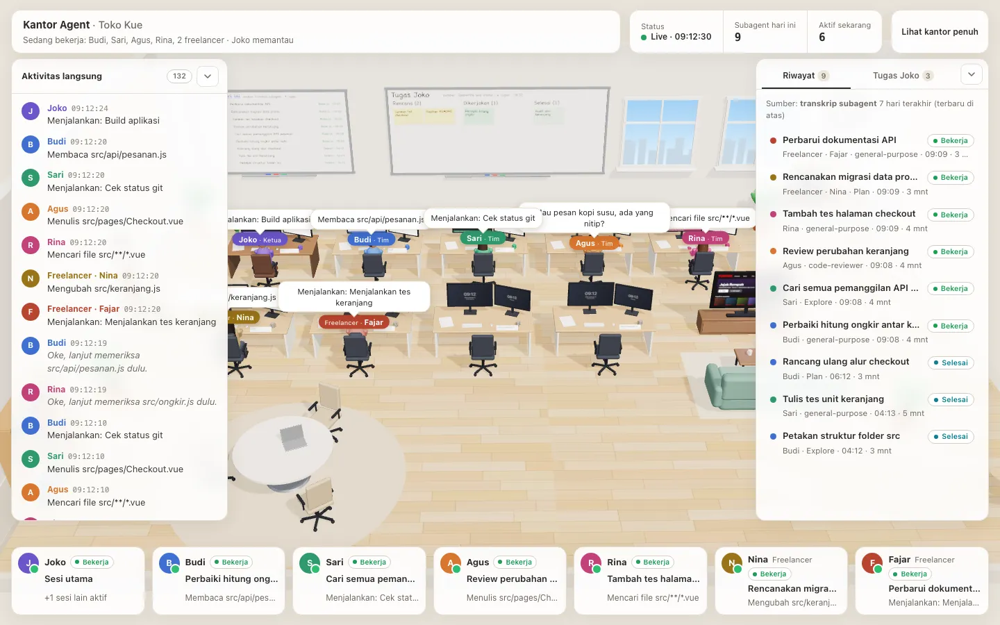
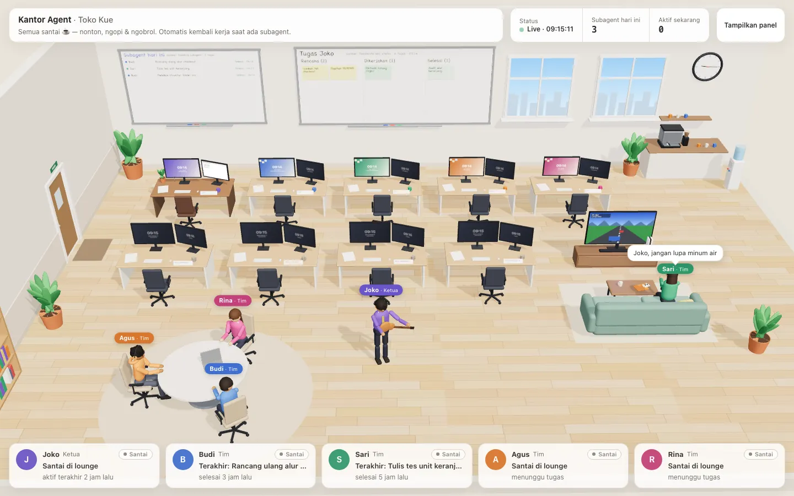
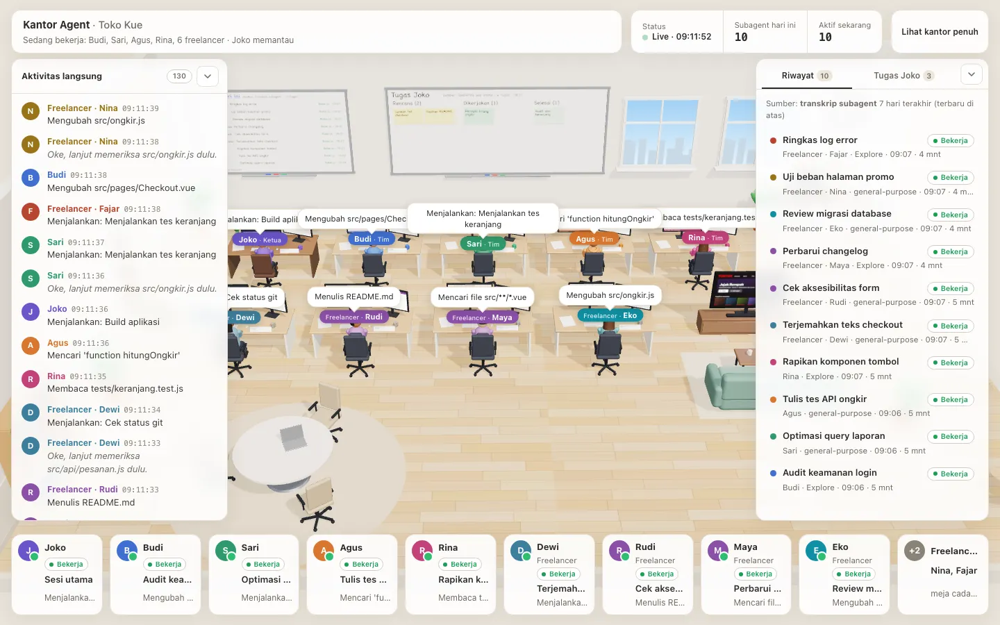
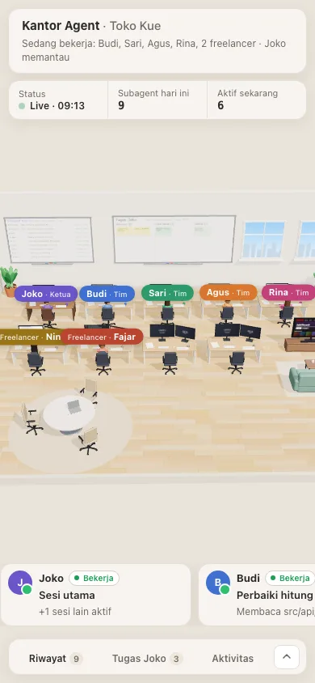

# Portfolio-ku — lihat Claude & subagent-nya bekerja di portfolio 3D

> **English summary.** Portfolio-ku is a zero-config [Claude Code](https://code.claude.com) plugin (one skill) that
> shows what Claude is doing in your project as a small 3D office (three.js). The main session is the team lead
> **Joko**, who works at his own desk. Four teammates — **Budi, Sari, Agus, Rina** — lounge in the break area (TV,
> coffee, games, guitar, small talk) and walk to a desk whenever Claude spawns a subagent of **any** type; when all
> four are busy, **freelancers** enter through the office door, work at spare desks, and leave when done. Everything
> is driven by the real, local Claude Code transcripts (`~/.claude/projects`), read-only and redacted — no fake
> activity. One command (`/portfolio-ku:portfolio-ku`) starts a local server (Node ≥ 18, or PHP ≥ 8.1) at
> `http://127.0.0.1:8788/kerja` without writing any file into your project; an optional cloudflared tunnel gives a
> temporary public URL. UI and docs are in Bahasa Indonesia. MIT licensed.



**Portfolio-ku** memperlihatkan apa yang sedang dikerjakan Claude Code di project-mu sebagai portfolio kecil 3D.
Tidak ada peran atau tim yang perlu diatur: sesi utama menjadi **Ketua**, setiap subagent dikerjakan oleh anggota
tim yang sedang santai, dan bila tim penuh datanglah **freelancer**. Semua gerakan berasal dari transkrip Claude Code
yang nyata — tanpa data karangan, tanpa login, tanpa konfigurasi.

## Daftar isi
- [Fitur](#fitur) · [Kebutuhan](#kebutuhan) · [Mulai cepat (plugin)](#mulai-cepat-plugin) · [Pasang manual](#pasang-manual)
- [Cara kerja](#cara-kerja) · [Tim & freelancer](#tim--freelancer) · [Pengaturan opsional](#pengaturan-opsional)
- [Mode menjalankan](#mode-menjalankan) · [URL publik (tunnel)](#url-publik-tunnel) · [Privasi](#privasi)
- [Masalah umum / FAQ](#masalah-umum--faq) · [Memperbarui](#memperbarui) · [Mencopot](#mencopot) · [Lisensi](#lisensi)

## Fitur
- **Nol konfigurasi, satu perintah.** `/portfolio-ku:portfolio-ku` menyalakan server lokal dan mencetak URL-nya.
  Tidak ada file yang ditulis ke folder project (cache & log di `~/.cache/portfolio-ku/`).
- **Ketua "Joko"** = sesi utama Claude. Bekerja di mejanya dengan pose sesuai aksi terakhir (mengetik, membaca,
  terminal, berpikir), santai saat sesi diam. Beberapa sesi aktif → yang terbaru ditampilkan + catatan "+N sesi lain".
- **Tim 4 orang** (Budi, Sari, Agus, Rina) nonton TV, main PS, ngopi, minum, main gitar, peregangan di jendela,
  duduk di meja rapat, baca di rak buku — sambil ngobrol receh. Saat Claude memanggil subagent, satu anggota berjalan
  ke mejanya ("Siap, saya kerjakan!"), bekerja sesuai aksi subagent itu, lalu kembali santai ("Beres!").
- **Freelancer** masuk lewat pintu bila keempat anggota sibuk, duduk di meja cadangan, lalu pulang lewat pintu.
  Tidak ada batas jumlah: 4 meja cadangan, sisanya kartu "+N" — tidak ada yang disembunyikan diam-diam.
- **Panel sederhana:** aktivitas langsung ("Joko meminta Budi: …"), riwayat subagent, daftar tugas `TodoWrite` sesi
  utama (juga di papan tulis), kartu Santai / Bekerja / Selesai, statistik *subagent hari ini* & *aktif sekarang*.
- **Node ≥ 18 atau PHP ≥ 8.1**, tanpa dependensi npm/composer; keluaran JSON identik (dijaga `bin/parity.mjs`).
- Ramah ponsel (tanpa scroll horizontal di 390 px), panel bisa diperkecil, menghormati `prefers-reduced-motion`.

| Semua santai | Tim penuh + freelancer | Ponsel |
|---|---|---|
|  |  |  |

> Semua tangkapan layar berasal dari project demo dengan transkrip **sintetis**.

## Kebutuhan
| Komponen | Keterangan |
|---|---|
| **Claude Code** | Versi dengan dukungan plugin (`/plugin`) dan subagent. Diuji di v2.1.283. Pasang manual: versi apa pun yang mendukung skills. |
| **Node ≥ 18** *(disarankan)* **atau PHP ≥ 8.1** (+ `mbstring`) | Salah satu cukup. Node dipakai bila ada, selain itu PHP. |
| bash, `curl` | Sudah ada di macOS & Linux. Windows: jalankan Claude Code di WSL. |
| Browser dengan WebGL | Chrome, Edge, Firefox, Safari modern (desktop & ponsel). |
| [cloudflared](https://developers.cloudflare.com/cloudflare-one/connections/connect-networks/downloads/) | Opsional — hanya untuk URL publik sementara. |

## Mulai cepat (plugin)
Di Claude Code (sesi mana pun):
```text
/plugin marketplace add vickyymosafan/portfolio-ku
/plugin install portfolio-ku@portfolio-ku
/reload-plugins
```
Atau dari terminal: `claude plugin marketplace add vickyymosafan/portfolio-ku && claude plugin install portfolio-ku@portfolio-ku`.

Lalu, **di folder project yang ingin dipantau**:
```text
/portfolio-ku:portfolio-ku
```
Keluaran kira-kira:
```text
Portfolio-ku berjalan (node) untuk project: toko-kue
  URL      : http://127.0.0.1:8788/kerja
  Hentikan : bash "…/skills/portfolio-ku/runtime/bin/portfolio-ku.sh" stop
```
Buka URL itu di browser. Perintah lain: `/portfolio-ku:portfolio-ku status`, `… stop`, `… publik` (URL publik),
`… tutup-publik`. Kamu juga cukup bilang "nyalakan portfolio-ku"; Claude akan memakai skill ini.

## Pasang manual
Tanpa sistem plugin — skill biasa bernama `/portfolio-ku`:
```bash
git clone https://github.com/vickyymosafan/portfolio-ku.git
mkdir -p ~/.claude/skills
ln -s "$PWD/portfolio-ku/skills/portfolio-ku" ~/.claude/skills/portfolio-ku   # atau: cp -R … ~/.claude/skills/
```
Buka sesi Claude Code baru di folder project lalu jalankan `/portfolio-ku`. Tanpa Claude pun bisa, langsung dari
terminal di folder project:
```bash
bash ~/.claude/skills/portfolio-ku/runtime/bin/portfolio-ku.sh start     # stop | status | restart | url | tunnel | detect
```
> Jangan memasang versi plugin **dan** manual bersamaan — keduanya akan tampil (`/portfolio-ku:portfolio-ku` dan
> `/portfolio-ku`). Pilih salah satu.

## Cara kerja
```text
~/.claude/projects/<slug-project>/<sesi>.jsonl                          ← sesi utama  → Ketua (Joko)
                                 /<sesi>/subagents/agent-<id>.jsonl      ← subagent    → Tim / Freelancer
                                 /<sesi>/subagents/agent-<id>.meta.json    {agentType, description, parentAgentId}
                                 /<sesi>/subagents/workflows/<wf>/agent-*  (subagent workflow)
        │  dibaca read-only & inkremental; hanya ringkasan tool_use — isi tool_result TIDAK pernah dibaca
        ▼
skills/portfolio-ku/runtime/   (dijalankan langsung dari folder plugin — tidak disalin ke project)
  bin/portfolio-ku.sh ── pilih runtime & port bebas ──┬─ Node:  bin/serve-node.mjs + lib/node/*.mjs
                                                └─ PHP:   php -S … public/index.php + lib/php/*.php
        │  cache, PID, log → ~/.cache/portfolio-ku/<slug-project>/
        ├── GET /kerja            halaman (views/page.html)
        ├── GET /kerja/api/state  JSON status, dipolling tiap 3 detik
        ├── GET /kerja/api/ping   identitas server (untuk start/stop idempoten)
        └── GET /kerja/assets/*   three.js r170 (vendored) + office.js
        ▼
Browser: portfolio 3D — meja Ketua, 4 meja tim, 4 meja cadangan, lounge, pintu, papan tulis, panel & kartu
```
- `<slug-project>` = path absolut project dengan setiap karakter non-alfanumerik diganti `-` (sama seperti Claude Code).
- Folder transkrip mengikuti `CLAUDE_CONFIG_DIR` (bila di-set) atau `HOME` — server berjalan sebagai user yang sama.
- **Status subagent:** *bekerja* (belum ada jawaban akhir & ada aktivitas ≤ 15 menit), *selesai* (jawaban akhir),
  *terhenti* (`TaskStop` dari sesi mana pun, atau tanpa aktivitas > 15 menit), *limit* (pesan batas pemakaian).
- **Status Ketua:** *bekerja* bila sesi utama aktif ≤ 90 detik, sedang menjalankan alat, atau menunggu subagent-nya;
  *selesai* sesaat setelah giliran berakhir; selain itu *santai*.

## Tim & freelancer
Penugasan dihitung ulang dari data setiap 3 detik dengan simulasi urut waktu, sehingga **selalu sama** untuk data
yang sama (aman dimuat ulang, identik di Node dan PHP):
1. Semua "job" subagent 7 hari terakhir diurutkan menurut waktu mulai.
2. Anggota tim **bebas** bila belum bertugas atau job terakhirnya selesai ≥ 60 detik sebelumnya. Job baru diberikan
   ke anggota bebas **pertama** menurut urutan tetap: Budi → Sari → Agus → Rina (masing-masing punya meja sendiri).
3. Keempatnya sibuk → **freelancer**: slot bebas terendah (meja cadangan 1–4; slot ke-5 dst. tampil di kartu "+N"),
   nama dari daftar (Yoga, Dewi, Rudi, Maya, Eko, Nina, Fajar, …) dipilih dari hash id subagent — nama yang sedang
   dipakai freelancer lain dilewati.
4. Subagent yang dibangunkan lagi (mis. `SendMessage`) tetap dikerjakan karakter yang sama bila ia masih bebas.
5. Akhir job: jawaban akhir, `TaskStop`, limit, atau 15 menit tanpa aktivitas (dihitung dari aktivitas terakhir,
   supaya penugasan job lain tidak berubah surut).

Contoh: 6 subagent berjalan bersamaan → Budi, Sari, Agus, Rina di meja masing-masing + 2 freelancer (mis.
"Freelancer · Nina", "Freelancer · Fajar") masuk lewat pintu. Budi selesai → "Beres!", kembali ke lounge; subagent
berikutnya yang mulai ≥ 60 detik kemudian akan dikerjakan Budi lagi.

## Pengaturan opsional
Tidak ada file konfigurasi yang wajib. Untuk mengganti nama, judul, atau port, buat
`<project>/.claude/portfolio-ku.json` (semua kunci opsional):
```json
{
  "title": "Toko Kue",
  "port": 8790,
  "names": {
    "ketua": "Pak Joko",
    "team": ["Bima", "Sari", "Ayu", "Rina"],
    "freelancers": ["Tono", "Wati", "Yoga"]
  },
  "autostart": false
}
```
| Kunci | Arti |
|---|---|
| `title` | Judul di bar atas (default: nama folder project). |
| `port` | Port awal (default `8788`; bila sibuk dipakai port bebas berikutnya). |
| `names.ketua` | Nama Ketua (default "Joko"). |
| `names.team` | 4 nama anggota tim (isi `null` untuk memakai bawaan di posisi itu). |
| `names.freelancers` | Daftar nama freelancer. |
| `autostart` | `true` = hook SessionStart plugin menyalakan server otomatis (lihat di bawah). |

Variabel lingkungan: `PORTFOLIO_PORT`, `PORTFOLIO_RUNTIME` (`node`/`php`), `PORTFOLIO_BIND` (default `127.0.0.1`),
`PORTFOLIO_STATE_DIR` (lokasi cache/log), `PORTFOLIO_ALLOWED_HOSTS` (host tambahan di belakang reverse proxy),
`PORTFOLIO_AUTOSTART=1`, `CLAUDE_CONFIG_DIR`. Perubahan nama/judul langsung terpakai (halaman memuat ulang sendiri).

## Mode menjalankan
| Cara | Perintah (dari folder project) |
|---|---|
| Node (bawaan) | `bash <runtime>/bin/portfolio-ku.sh start` |
| PHP | `bash <runtime>/bin/portfolio-ku.sh start --php` |
| Port lain | `bash <runtime>/bin/portfolio-ku.sh start --port 9000` |
| Status / hentikan | `bash <runtime>/bin/portfolio-ku.sh status` · `… stop` · `… restart` |
| Jaringan lokal (LAN) | `PORTFOLIO_BIND=0.0.0.0 bash <runtime>/bin/portfolio-ku.sh restart` → `http://<ip-komputer>:8788/kerja` |
| Otomatis saat sesi mulai | `"autostart": true` di `.claude/portfolio-ku.json` (plugin) |

`<runtime>` = `~/.claude/skills/portfolio-ku/runtime` (pasang manual) atau folder plugin — skill mencetak path persisnya.
`start` idempoten: bila server sudah berjalan untuk project itu, hanya URL yang dicetak; setelah plugin diperbarui,
`start` otomatis memulai ulang server dengan versi baru. Setiap project mendapat servernya sendiri.

**Autostart (opsional, mati secara bawaan).** Plugin memasang hook `SessionStart` yang **tidak melakukan apa pun**
kecuali project mengaktifkannya (`"autostart": true`) atau `PORTFOLIO_AUTOSTART=1` di-set. Hook itu senyap (tanpa output
ke sesi), selesai dalam milidetik, dan menjalankan server di latar belakang. Pemasangan manual tidak memasang hook;
bila ingin, tambahkan ke `.claude/settings.json` project:
```json
{ "hooks": { "SessionStart": [ { "hooks": [ { "type": "command",
  "command": "PORTFOLIO_AUTOSTART=1 bash ~/.claude/skills/portfolio-ku/runtime/bin/portfolio-ku.sh autostart" } ] } ] } }
```

## URL publik (tunnel)
```text
/portfolio-ku:portfolio-ku publik        (atau: bash <runtime>/bin/portfolio-ku.sh tunnel)
```
Membuka quick tunnel cloudflared → `https://<acak>.trycloudflare.com/kerja` (tampil juga di halaman). Matikan dengan
`… tutup-publik` / `portfolio-ku.sh tunnel-stop`; `stop` juga mematikannya. URL berganti setiap kali tunnel dibuka ulang.

> ⚠️ **Keamanan: halaman ini tidak punya login.** Isinya read-only dan diredaksi, tetapi tetap memperlihatkan
> deskripsi tugas subagent, nama file, dan ringkasan aktivitas project. **Siapa pun yang tahu URL publik bisa
> membukanya.** Bagikan hanya ke orang yang kamu percaya dan matikan tunnel setelah selesai. Server bawaan hanya
> mendengarkan di `127.0.0.1`.

## Privasi
- **Yang tampil:** deskripsi tugas subagent & jenisnya, nama alat + path file relatif, deskripsi perintah Bash (bukan
  argumennya), baris pertama teks subagent, daftar `TodoWrite` sesi utama, jumlah aksi & token, waktu.
- **Yang tidak pernah dibaca/ditampilkan:** isi `tool_result` (output perintah, isi file), argumen perintah Bash,
  prompt lengkap ke subagent, teks jawaban sesi utama.
- **Redaksi otomatis** (Node & PHP identik): `password|sandi|secret|token|api_key = …`, `sk-…`, `ghp_…`, `xox?-…`,
  `AKIA…`, hex ≥ 40 karakter, alamat email, kredensial di URL → `•••`.
- Header `noindex`, `no-referrer`, CSP ketat, `X-Frame-Options: DENY`; hanya GET/HEAD; aset dibatasi whitelist;
  permintaan dengan Host asing ditolak (perlindungan DNS rebinding).
- Tidak ada font, analitik, atau sumber daya eksternal yang dimuat; tidak ada data yang dikirim ke mana pun
  (kecuali lewat tunnel yang kamu nyalakan sendiri).
- Obrolan receh karakter adalah teks tetap yang tidak pernah menyebut data nyata.

## Masalah umum / FAQ
**Semua karakter santai terus.** Portfolio hanya bergerak bila ada aktivitas nyata. Pastikan server dijalankan dari
**folder yang sama** dengan tempat Claude Code dibuka (path harus identik — hindari membuka lewat symlink). Cek
`bash <runtime>/bin/portfolio-ku.sh status` → baris *Transkrip* menunjukkan folder yang dibaca dan jumlah sesinya.

**Subagent sudah dihentikan tapi karakter masih bekerja.** Subagent yang dihentikan lewat `TaskStop` langsung
terdeteksi. Bila prosesnya mati tanpa jejak (mis. Claude Code ditutup), karakter kembali santai setelah 15 menit
tanpa aktivitas.

**Port sudah dipakai.** Otomatis pindah ke port bebas berikutnya (sampai +20). Pilih sendiri: `--port 9000` atau
`"port"` di config.

**"Butuh Node ≥ 18 atau PHP ≥ 8.1".** Pasang salah satu (Node: https://nodejs.org). PHP butuh ekstensi `mbstring`.

**Layar kosong / 3D tidak tampil.** Browser butuh WebGL (panel tetap berjalan tanpa WebGL). Coba browser lain atau
aktifkan akselerasi grafis.

**Membuka dari ponsel.** Satu jaringan: `PORTFOLIO_BIND=0.0.0.0 … restart` lalu buka `http://<ip-komputer>:8788/kerja`
(siapa pun di jaringan itu bisa membukanya). Beda jaringan: pakai [tunnel](#url-publik-tunnel).

**Di belakang reverse proxy / domain sendiri.** Teruskan seluruh prefiks `/kerja` ke `127.0.0.1:<port>` dan set
`PORTFOLIO_ALLOWED_HOSTS=portfolio.domainmu.com` (tanpa itu server menolak Host asing dengan 421). Pasang autentikasi di proxy.

**Karakter berjalan pelan / patah-patah.** Perangkat lambat merender dengan fps rendah; gerakan tetap sampai tujuan.
Aktifkan "Kurangi gerakan" (prefers-reduced-motion) di sistem untuk berpindah tanpa animasi.

**URL publik belum bisa dibuka.** Alamat `trycloudflare.com` yang baru butuh ±30 detik sampai dikenal DNS. Bila
browser sempat gagal lebih awal, ia bisa menyimpan kegagalan itu sebentar — tunggu lalu muat ulang (atau buka dari
perangkat lain).

**Windows.** Jalankan Claude Code dan Portfolio-ku di WSL (butuh bash).

## Memperbarui
- **Plugin:** `claude plugin marketplace update portfolio-ku` lalu `claude plugin update portfolio-ku@portfolio-ku`
  (atau `/plugin` → **Installed** → **Update now**), kemudian `/reload-plugins` dan jalankan skill lagi — server lama
  otomatis diganti versi baru.
- **Manual:** `git pull` di folder clone (symlink langsung ikut), lalu `portfolio-ku.sh restart`.

## Mencopot
1. Hentikan server di setiap project yang memakainya: `bash <runtime>/bin/portfolio-ku.sh stop`.
2. Plugin: `claude plugin uninstall portfolio-ku@portfolio-ku`, lalu `claude plugin marketplace remove portfolio-ku`.
   Manual: `rm ~/.claude/skills/portfolio-ku` (symlink) atau `rm -rf ~/.claude/skills/portfolio-ku`.
3. Hapus cache & log: `rm -rf ~/.cache/portfolio-ku`. Bila pernah membuat `.claude/portfolio-ku.json`, hapus juga.

## Kontribusi
Issue dan pull request dipersilakan di [github.com/vickyymosafan/portfolio-ku](https://github.com/vickyymosafan/portfolio-ku).
- Logika server ada di **dua** runtime: ubah `lib/node/*.mjs` **dan** `lib/php/*.php`, lalu jalankan
  `node skills/portfolio-ku/runtime/bin/parity.mjs --project=<project-uji>` (harus `PARITY OK`).
- Validasi plugin: `claude plugin validate --strict .`.
- Jangan pernah menyertakan transkrip, path, atau data project nyata di contoh/tangkapan layar.

## Lisensi
[MIT](LICENSE) © vickyymosafan. Komponen pihak ketiga yang disertakan (three.js r170 — MIT) tercantum di
[THIRD_PARTY_NOTICES.md](THIRD_PARTY_NOTICES.md).
